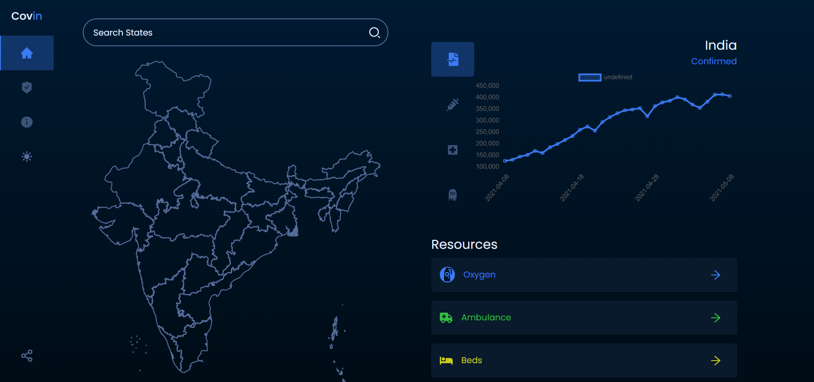
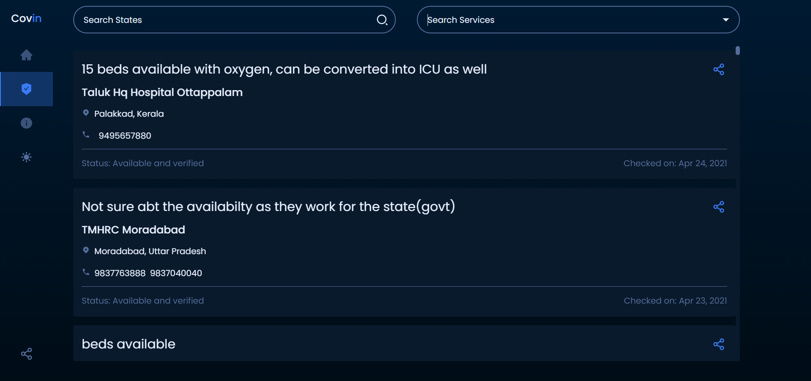
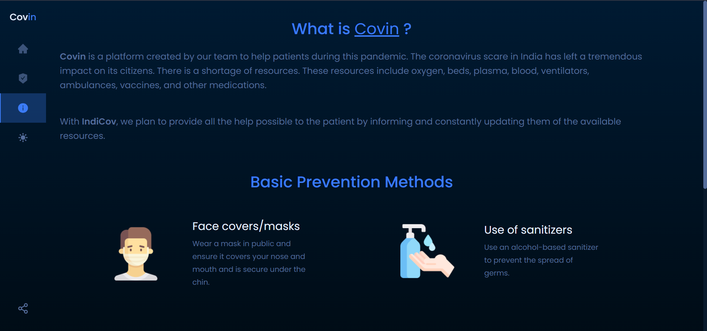

***
## Table of Contents
1. [General Info](#General-Info)
2. [Images](#Images)
3. [APIs Used](#APIs-Used)
4. [Installation](#installation)
5. [Technologies Used](#technologies-used)
6. [Future Scope](#future-scope)
6. [Team](#team)
***
## General Info
The objective of this project was to develop a reliable site where one can find all
necessary information related to Coivd-19 like Number of Covid infections,recoveries,
deaths in India and also in respective states. In addition to that this project also 
provides reliable  details of Availabilty of Oxygen Cylinders,Beds, Essential
medicines  in the selected location.
***
## Images







***

## APIs Used
 
| Data                              | URL                                                                             |
| --------------------------------- | ------------------------------------------------------------------------------- |
| List of districts with Data       | <https://life-api.coronasafe.network/data/active_district_data.json>         |
| Ambulance availability            | <https://life-api.coronasafe.network/data/ambulance.json>                       |
| Helpline Numbers                  | <https://life-api.coronasafe.network/data/helpline.json>                        |
| Hospitals and Beds                | <https://life-api.coronasafe.network/data/hospital.json>          |
| Medicine availability             | <https://life-api.coronasafe.network/data/medicine.json>                        |
| Oxygen availability               | <https://life-api.coronasafe.network/data/oxygen.json>                          |


***
## Installation

Instructions to run the file locally:

```
git clone https://github.com/skundu42/Covin
npm install
npm run dev
# or
yarn dev
```
*** 
## Technologies used
* React
* Node
* HTML 
* CSS
* Mongo DB
* Express
***
## Future Scope

* Our project will benefit the Public in numeroues ways but what will be its use after Covid-19 To effectively tackle any more future pandemics,a multipronged approach should be used. As the reach of such an site will be greater it can provide an opportunity to prepare for similar future outbreaks internationally. 
* Through machine learning and AI methods, automatic  and rapid identification of suspected infections will become more accurate in the future.This site will be able to show pandemic hotspots in the future thus giving awarness to Govt and People where to focus and restrict movment.Addition of these features will provide a more holistic public health approach in response to the situation. 
* In a Non Pandemic situation this site can be benefiical too Important functionalities that can be integrated into this can be provision of data regarding Treatment Centres(Hospitals,Clinics) specializing in treatment of ailmentslike Heart dieseases, Cancer,Congenital diseases,etc,Availibilty of e
Availibilty of essential medicines relating  to above ailments.

***

## Team
* Sandipan Kundu
* Divyesh Das


